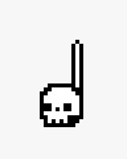
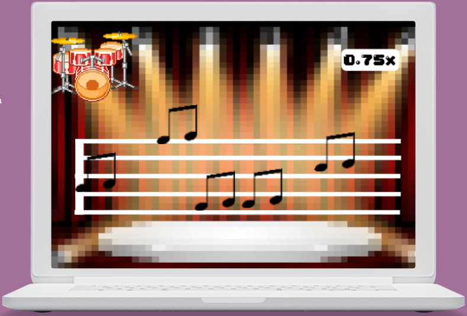

# **Party of the Drumancer**

## _Game Design Document_

---

---

**Pablo Rocha A01028638**

**Miguel Arriaga A01028570**

**Luis Javier Karam Galland A01751941**

## _Index_

---

- [ Party of the Drumancer ](#party-of-the-drumancer)
  - [_Game Design Document_](#game-design-document)
  - [_Index_](#index)
  - [_One Page Document_](#one-page-document)
  - [_Game Design_](#game-design)
    - [**Summary**](#summary)
    - [**Gameplay**](#gameplay)
    - [**Mindset**](#mindset)
  - [_Technical_](#technical)
    - [**Screens**](#screens)
    - [**Controls**](#controls)
    - [**Mechanics**](#mechanics)
  - [_Level Design_](#level-design)
    - [**Themes**](#themes)
    - [**Game Flow**](#game-flow)
  - [_Development_](#development)
    - [**Abstract Classes / Components**](#abstract-classes--components)
    - [**Derived Classes / Component Compositions**](#derived-classes--component-compositions)
  - [_Graphics_](#graphics)
    - [**Style Attributes**](#style-attributes)
    - [**Graphics Needed**](#graphics-needed)
  - [_Sounds/Music_](#soundsmusic)
    - [**Style Attributes**](#style-attributes-1)
    - [**Sounds Needed**](#sounds-needed)
    - [**Music Needed**](#music-needed)
  - [_Schedule_](#schedule)

## _One Page Document_

[Open one page document](/one-page-PAS.pdf)

## _Game Design_

---

### **Summary**

The game in going to be inspired in Guitar Hero, adapted for a drumset learning. Notes are going to move across the screen on a partiture and the player needs to play them at the correct time. This will help the player learn to read partitures and rhythm.

### **Gameplay**

Notes will move across the screen and the player must play them at the correct time. The goal is to play the most correct notes possible to get the maximum score. Good scores will unlock new songs.
The drums notes will be represented with keystrokes.

### **Mindset**

We want to give a drummer mindset to the player. The feeling of what it is like to play music and slowly improve. The player will feel the stress that comes from learning a new instrument and the glory of achieving a goal. We intend to achieve this by challenging the user to slowly learn new song and unlocking new challenges.

## _Technical_

---

### **Screens**

1. Log In Screen
2. Home/Level Select
3. Game
   1. Assessment / Next Level

### **Controls**

The player will interact with the game with keystrokes. Each drum will be represented by key. For example: The bass drum could be represented by the "J" key. The player will not be able to choose his inputs, they will be decided by the development team.

The main in-game-events are going to be:

1. When a player hits a key the correspondent drum will sound.
2. If the key corresponds to the drum that had to be played according to the partiture, the score will increase.

### **Mechanics**

The first part f the development process will be to implement an algorithm capable of transforming a music file or string of a partiture into something readable by Unity. Then the game engine will be able to instance the adequate notes at the correct time for the music to play.

When a player starts a level (song) the notes will start showing up accordingly. The correct zone will be located in the left of the screen. If you press the correct key at that time it will give you 100 points. A bit early or a bit late will give the player 60 points, very early or late will give 10.

When a level is completed, if the minimum score is reached, the player is able to move on to the next one. The user will have to repeat the level if the minimum points are not reached.

## _Level Design_

The game will be based in a cemetery, in which a hooded figure will play the drumset and other monsters such as skeletons and blobs will cheer for him.

The game will have three base levels, which are going to be represented as songs. Each song will be harder than the previous, including more difficult notes and tempos to play.

The visual styles of the levels are all going to be similar, however, more elements are going to be added as the level progresses. This graphic style will be described fully in the graphic section.

The playability of each level will also be based around the same gameplay concept already described. The only new mechanics introduced with each level will be faster tempos, meaning that the notes will travel across the screen with higher intensity and more complicated partitures to read.

### **Themes**

1. Cemetery
   1. Mood
      1. Dark, party
2. Objects
   1. _Ambient_
      1. Tombstones
      2. Skeletons
      3. Blobs
      4. Bats
      5. Dancing monsters
      6. Party lights
   2. _Interactive_
      1. Music notes made out of bones

_Example early development sprites_

   

### **Game Flow**

1. In the main screen, the player will be able to login and start a new game or existing one.
2. Player/hooded figure will be sat in a drumset, in a cemetery.
3. Notes will begin to fly across the screen as music starts, the player must play them.
4. The ambient, already surrounded by tombstones, will become more party-intense as the player plays notes.
5. Skeletons and other monsters will begin to rise from the death and dance and party as the player progresses though the song/score.
6. When the song ends, the crowd will cheer and in case of having the required score, a pop up to the next level will appear.
7. Otherwise, a retry pop up will appear.

_Example mockup_

_Example main screen from Graveyard Keeper_

## _Development_

---

### **Abstract Classes / Components**

1. Conductor (Used to keep track of the song)
2. SceneLoader (Used to manage scenes)
3. MusicPlayer

### **Derived Classes / Component Compositions**

1. BaseNote
   1. WholeNote
   2. HalfNote
   3. QuarterNote
   4. EightNote
   5. SixteenthNote
2. BaseRest
   1. WholeRest
   2. HalfRest
   3. QuarterRest
   4. EightRest
   5. SixteenRest
3. BaseHitbox
   1. EarlyHitbox
   2. GoodHitbox
   3. PerfectHitbox
   4. LateHitbox
4. BaseDancer
   1. SkeletonDancer
   2. SlimeDancer
   3. MonsterDancer

_Example from guitar hero_

## _Graphics_

---

### **Style Attributes**

Dark palette consistent for all the levels

Pixel-Art graphics surrounded by black lines (Cartoony style)

Visual feedback for hitting a note right (flashes of color, text showing how good the press was) as well as if there was a bad hit or none at all, progressively more audience as the score gets higher.

### **Graphics Needed**

1. Characters
   1. Hooded-Figure (Player)
   2. Dancers
      1. Skeleton
      2. Slime
      3. Zombie
      4. etc.
2. Blocks
   1. Dirt
   2. Dirt/Grass
   3. Stone Block
   4. Stone Bricks
   5. Tiled Floor
   6. Weathered Stone Block
   7. Weathered Stone Bricks
3. Scene
   1. Background Graveyard
      1. Tombstones
      2. Bones
      3. Grass
      4. Dirt
      5. river?
   2. Pentagram
      1. Large bones for pentagram lines
      2. Notes (Skull themed)
         1. Whole note
         2. Half note
         3. Quarter note
         4. Eighth note
         5. Sixteenth note
         6. Whole rest
         7. Half rest
         8. Quarter rest
         9. Eighth rest
         10. Sixteenth rest

_Example from crypt of the necrodancer_

## _Sounds/Music_

---

### **Style Attributes**

The music style will be very varied. Because the game wants to focus on people learning how to play drums, the bigger and more diverse our songs options are, the more will the player have the chance to practice various genres.

For the sound effects we will add cheering noises for the crowd or booing noises for when the player messes up a few notes, we also require drum sounds that play depending on which key press is detected in the game. The drum sound should be a bit louder than usual so that the player can hear himself play and therefore make improvements on his performance. Any stylistic sounds like the crowd should have a very low volume since we do not want to overwhelm the player with sound.

### **Sounds Needed**

1. Effects
   1. Snare drum
   2. tom-toms
   3. floor tom
   4. ride cymbal
   5. crash cymbal
   6. hi-hat cymbal
   7. bass drum
2. Feedback
   1. crowd cheering (High combo)
   2. crowd booing (consecutive failed notes)
   3. explosions (Very high combo)
   4. Pause menu sound

### **Music Needed**

1. Slow-paced track for easy starting levels
2. Fast songs to push the player to improve
3. Extremely difficult songs to give the player a long-term goal
4. Menu music

## _Schedule_

---

This is only a reference, and can change as the project is developed, as the methodology being used to manage the project is SCRUM.

1. develop conversion systems
   1. partiture system
      1. sound to notes conversion
2. develop base classes
   1. base entity
      1. base player
      2. base music partiture
3. base app state
   1. game world
   2. menu world
4. additional gameplay mechanics
   1. physics
   2. collisions
5. find some smooth controls/keys
6. develop other derived classes
   1. effects and ambient
      1. notes
      2. explosions
      3. lights
      4. trees
   2. undead party
      1. skeleton
      2. blob
      3. zombies
      4. etc.
7. design levels
   1. introduce different songs
   2. introduce scores
   3. mind the pacing, let the player progress at a good curve
8. design sounds
9. design music
