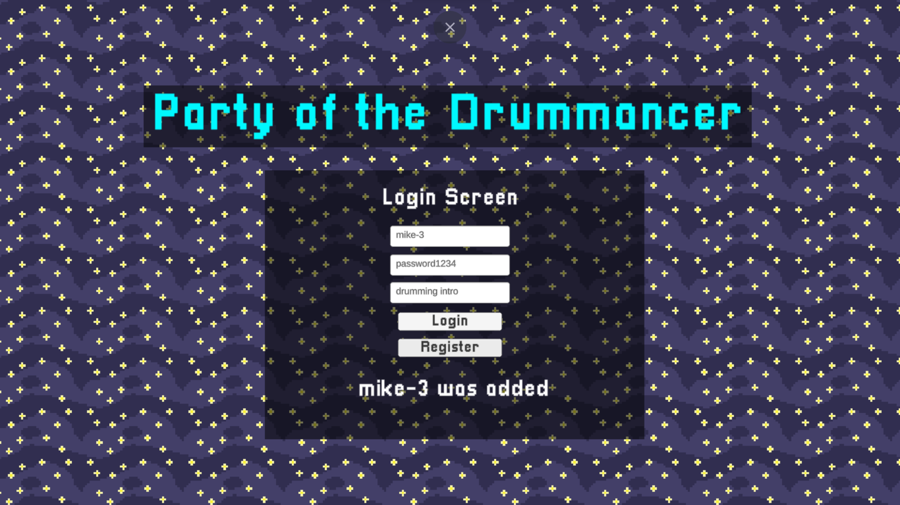
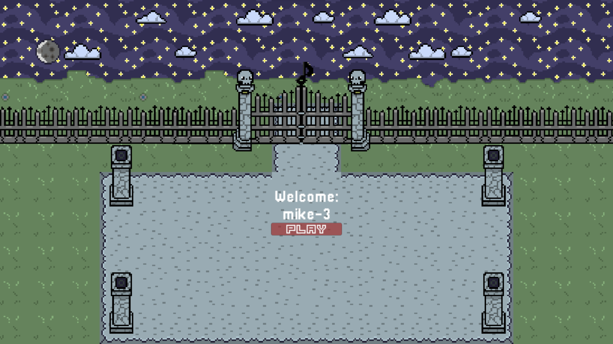
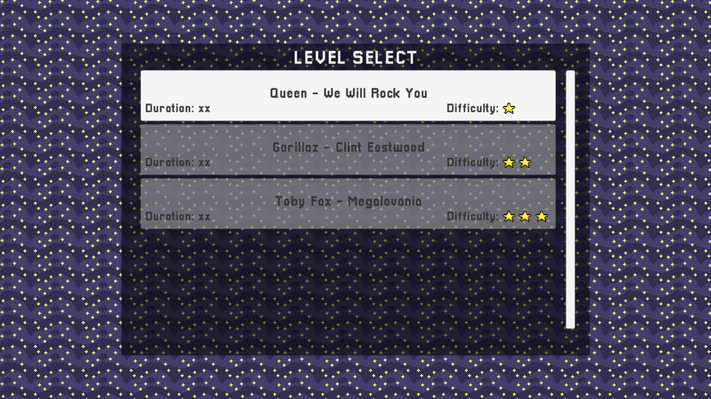
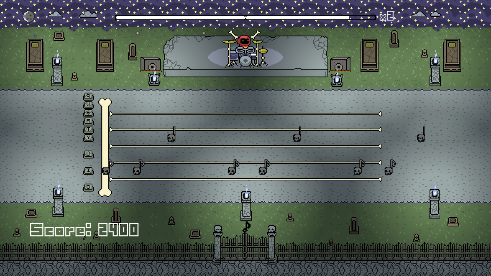
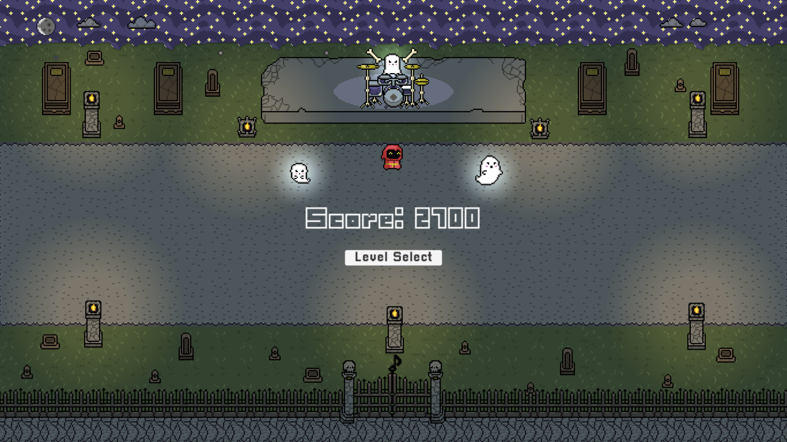
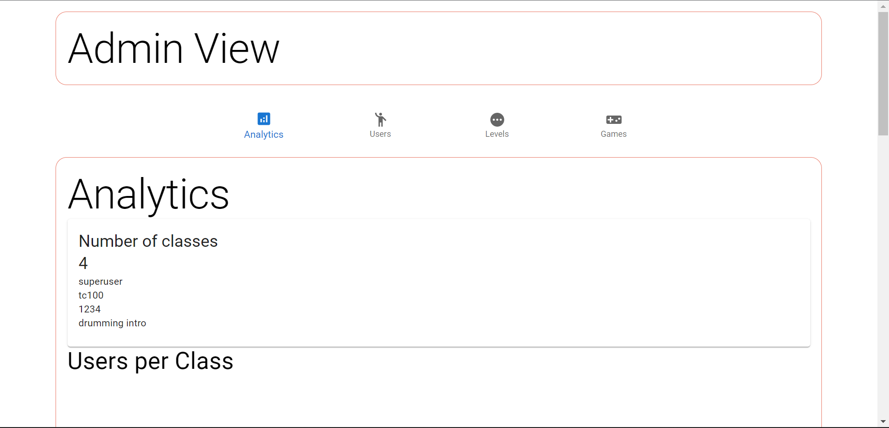
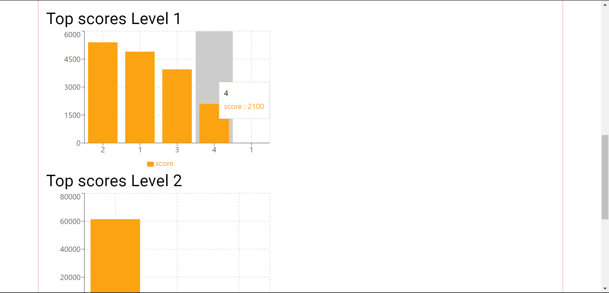
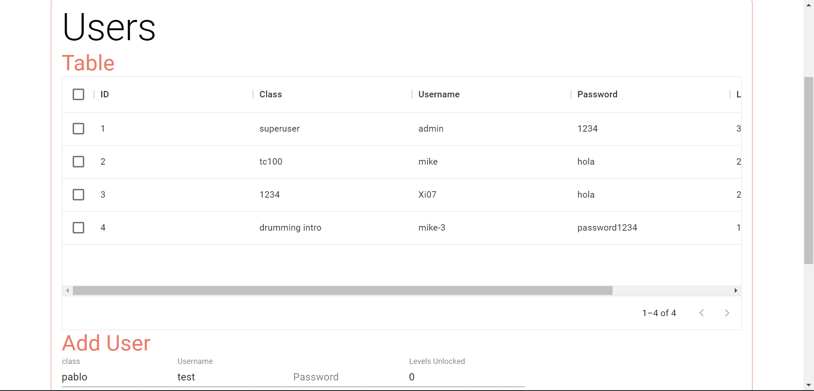

# Software-Construction-And-Decision-Making

## Team members

> - Pablo Rocha A01028638
> - Miguel Arriaga A01028570
> - Luis Javier Karam A01751941

## Summary

Github repository for the "TC2005B Construcción de software y toma de decisiones" final project, a videogame for Percussive Arts Society.

Link to presentation video
https://www.youtube.com/watch?v=DLAVMNRuGy4

## Table of contents

> - [Title](#software-construction-and-decision-making)
> - [Team members](#team-members)
> - [Summary](#summary)
> - [Table of contents](#table-of-contents)
>   - [Resources (Documentation and other links)](#resources-documentation-and-other-links)
>   - [Installation](#installation)
>   - [Usage](#usage)
>     - [Screenshots](#screenshots)
>     - [Features](#features)
>     - [Content](#content)

## Resources (Documentation and other links)

> - The final documentation can be found under the following path: Construccion-de-software/Documentation/Final documentation
> - The instructions to run the project can be found under the following path: Construccion-de-software/Documentation/Instructions
> - The game design document can be found under the following path: Construccion-de-software/Documentation/GameDesign.md
> - A one pager document can be found under the following path: Construccion-de-software/Documentation/one-page-PAS.pdf
> - SCRUM meetings documentation can be found under the path: Construccion-de-software/Documentation/SCRUM Documentation
> - Additionally, the SCRUM documentation can be found here: https://www.notion.so/Documentaci-n-Party-of-the-drumancer-0273914c292549298ddc3217197c1b4c
> - SCRUM board - https://trello.com/b/UmyvtmKg
> - Use cases UML diagram - https://drive.google.com/file/d/1fw1fh4GsFW3W6OVMM372a9XNNlQvyU_8/view?usp=sharing

## Installation

Clone or fork this repository and install node, mysql, react and npm in your computer.

## Usage

1. Run the PAS_drummancer_DB.sql mysql script, under the path: Construccion-de-software/db-module/PAS_drummancer_DB.sql
2. This will create the database in your computer.
3. Go to the following path: Construccion-de-software/web-module/dataAcquisition/back/
4. Create a .env file in the directory. There is a .env example and readme file to help you do this.
5. Run the following commands in the directory:

```
npm install
npm run dev
```

6. These commands will run the API in your computer.
7. Go to the following path: Construccion-de-software/web-module/game-web-page/
8. Run the following commands:

```
npm install
npm run start
```

9. These commands will run the webpage in which you can play the game.
10. (Optional) Go to the following path: Construccion-de-software/web-module/dataAcquisition/front/
11. Run the following commands:

```
npm install
npm run start
```

12. These commands will open the admin. webpage for the game.

### Screenshots

#### Game screenshots







#### Admin webpage screenshots





### Features

- The game connects itself with the API, allowing you to sing in and login with your same account latter.
- Depending on your score you can unlock the next level for the game. This will be registered in the database.
- The admin. view allows you to see statistics in tables and charts, such as high scores and users.
- The admin can also add new levels, users amd games or even edit or delete them.

### Content

> - Documentation - Final documentation of the game
> - db-module - Database module
> - web-module - Web module
> - videogame-module - Videogames module
> - software-engineering-module - Software Engineering module
